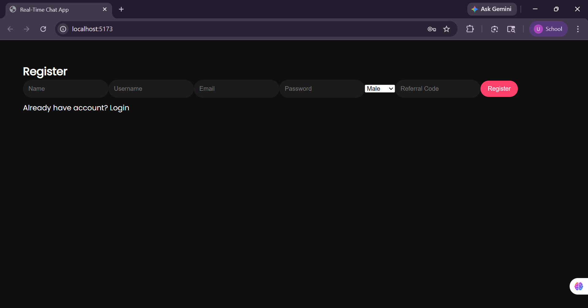
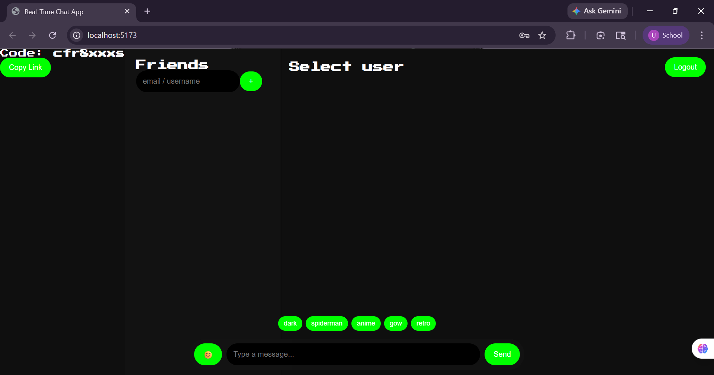
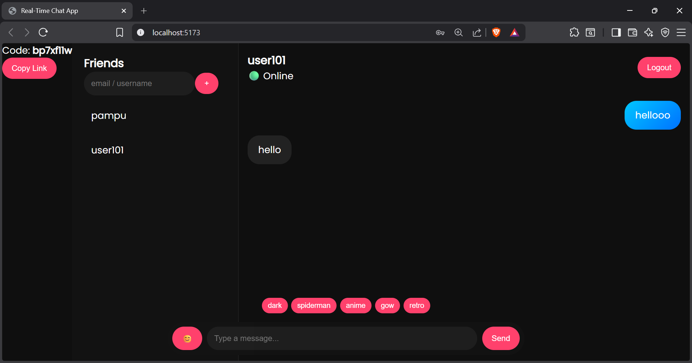

# 💬 Real-Time Chat Application

🚀 A full-stack real-time chat application that enables users to connect, add friends, and exchange messages instantly using modern web technologies.

🔗 **Live Demo:**  
https://realtime-chat-app-phi-blush.vercel.app/

---

## ✨ Features

- 🔐 Secure Authentication (JWT आधारित login/register)
- 💬 Real-time messaging using Socket.io
- 👥 Add friends via email/username
- 🟢 Online / Offline user status
- 🔗 Unique referral / invite code system
- ⚡ Instant message delivery (low latency)
- 🎨 Multiple UI themes (dark, anime, retro, etc.)
- 📱 Responsive UI design
- 💾 Persistent chat storage (MongoDB)

---

## 🛠️ Tech Stack

### Frontend
- React.js
- Axios
- CSS (Custom Themes)

### Backend
- Node.js
- Express.js
- Socket.io

### Database
- MongoDB (Mongoose)

### Authentication
- JWT (JSON Web Tokens)

---

## 📸 Screenshots

### 🔐 Login Page


### 📝 Register Page


### 💬 Chat Interface


### 🟢 Real-Time Messaging


---

## ⚙️ Installation & Setup

### 1️⃣ Clone Repository
```bash
git clone https://github.com/ujjawal10024/realtime-chat-app.git
cd realtime-chat-app
